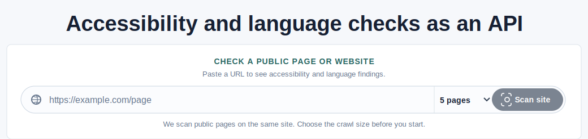

```text
  ___  ____  _____ _   _    _    ____     _
 / _ \|  _ \| ____| \ | |  / \  |  _ \   / \
| | | | |_) |  _| |  \| | / _ \ | | | | / _ \
| |_| |  __/| |___| |\  |/ ___ \| |_| |/ ___ \
 \___/|_|   |_____|_| \_/_/   \_\____//_/   \_\
        OPEN ACCESS FOR THE PUBLIC WEB
```

# OpenADA

[](https://github.com/techcto/openada/actions/workflows/ci.yml)
[](https://github.com/techcto/openada)
[](https://openai.devpost.com/)

This is a brand-new project built 100% for [OpenAI Build Week](https://openai.devpost.com/), the OpenAI Codex challenge. GPT-5.6 is here, and Codex is now available in ChatGPT; this project explores what is possible when a coding agent helps turn a public-interest idea into a complete, deployed service. Submissions are due Tuesday, July 21 at 5:00 PM PT.

## Why We Built OpenADA

Two days after the contest began, we received the contest email. On July 16,
2026, we purchased the OpenADA.us domain through GoDaddy and started building
with a simple goal: do something good for the world and give back by creating
free accessibility infrastructure that can benefit many people, powered by
OpenAI Codex.

The product idea itself was born during this contest. Before we started, we had
not imagined turning public accessibility scans into a browsable, dated archive
that people and AI agents could query, compare, and improve over time. The
contest gave us the spark, and working with GPT-5.6 Luna in Codex helped turn
that unexpected idea into a deployed, turnkey platform.

Start with the [OpenADA Quickstart](Quickstart.md) for local testing, AWS Marketplace deployment, and AgentCore setup.

OpenADA is a hosted accessibility and language-quality service for the web. It gives web developers, agencies, public entities, and site owners one stable API for WCAG audits and LanguageTool-compatible spelling and grammar checks, then turns public site scans into a transparent, date-based archive anyone can browse.

## The Problem

The Department of Justice's April 20, 2026 interim final rule extended the Title II compliance date to April 26, 2027 for covered public entities with populations of 50,000 or more, and to April 26, 2028 for smaller public entities and special district governments. The extension acknowledges the practical burden; it does not make accessible public services optional. Read the [Federal Register rule](https://www.federalregister.gov/documents/2026/04/20/2026-07663/extension-of-compliance-dates-for-nondiscrimination-on-the-basis-of-disability-accessibility-of-web).

This is a serious compliance and delivery problem, not a cosmetic feature request. Inaccessible public services can lead to complaints, Department of Justice enforcement, litigation, settlement obligations, attorneys' fees, and expensive remediation. The exact remedy depends on the facts and applicable law, but the financial and operational consequences are real. OpenADA does not determine legal compliance or liability; it helps teams find and fix concrete problems before they become harder and more expensive to address.

Every public website is part of a public service: applying for a permit, finding an emergency contact, paying a bill, registering for school, or understanding a local policy. When a site is inaccessible, residents with disabilities are shut out of the same services everyone else depends on.

This is a national delivery problem, not a niche feature request. State and local governments are working through the DOJ's web-accessibility requirements while facing limited budgets, small technology teams, aging websites, vendors, PDFs, forms, and thousands of pages that must be understood and improved.

Commercial accessibility platforms can be difficult for a small city, county, school district, library, or special district to afford. OpenADA is built around a simple public-interest proposition: every government should be able to scan its own website for free, see which pages need attention, understand the findings, and measure improvement over time. The project starts as free infrastructure for public entities and developers; optional enterprise API capacity can help fund continued public access later.

OpenADA is not a legal determination or a substitute for human accessibility testing, procurement review, or counsel. It is a practical starting point that turns a large, expensive, easy-to-ignore problem into a queue of concrete pages and findings.

## Contest Pitch

### The 30-Second Demo

Paste a public URL, choose a crawl size, and press **Scan site**. OpenADA queues the work, shows live progress while pages are checked, and redirects to a public report. A visitor can then move through the archive:

`site -> scan date -> pages -> page findings -> the same page across time`



The checker makes the first step clear: paste a public page or website URL, choose how many same-site pages to scan, and start the crawl.

Try it live:

- [OpenADA checker](https://openada.us/)
- [Public directory](https://openada.us/directory)
- [Public API reference](https://openada.us/api-reference)
- [ADA guidance](https://openada.us/docs)

### AI Access And Product Modes

OpenADA is usable in the tools where developers and accessibility teams already
work. The public MCP endpoint is documented for **ChatGPT Developer Mode**,
**OpenAI Codex CLI and IDE**, and **Claude custom connectors**. Each integration
has step-by-step setup instructions, the correct `/mcp` endpoint, authentication
guidance, example prompts, and links to the official client documentation in the
[MCP connection guide](https://openada.us/docs/mcp).

The project has two complementary deployment products:

- **Public OpenADA:** a hosted, anonymous service for testing public pages,
  running bounded same-host scans, browsing dated reports, and trying the API or
  MCP tools without managing infrastructure.
- **Private OpenADA:** an AWS Marketplace ECS deployment for organizations that
  need their own UI, API, scan worker, Redis queue, DynamoDB archive, VPC, API
  keys, allowed-host controls, and operational boundary.
- **OpenADA MCP AgentCore:** a separate ARM64, stateless MCP gateway for Amazon
  Bedrock AgentCore Runtime. It connects an AI agent to either the hosted public
  service or a private OpenADA endpoint; AgentCore supplies the AWS IAM/SigV4
  runtime boundary while OpenADA performs the checks and scans.

The [root Quickstart](Quickstart.md), [Private OpenADA Quickstart](devops/cloudformation/README.md),
and [AgentCore Quickstart](devops/agentcore/README.md) explain which path to
choose and how to launch it.

## Judging Criteria

### Technological Implementation

OpenADA is a real, deployed service rather than a static demo. Codex was used as an engineering collaborator across the full loop: shaping the API and MCP tools, building the crawler and durable scan workflow, iterating on the UI, writing CloudFormation and container workflows, debugging production behavior, and verifying the live AWS deployment. The result is a working Next.js UI, API service, asynchronous scan worker, Redis-backed queue, DynamoDB archive, public widget, OpenAPI document, stateless AgentCore gateway, and GitHub Actions Marketplace release path.

### Design

The product has a complete workflow: a search-style URL entry point, a fast five-page default for first-time testing, adjustable crawl limits, progress feedback, a report route, a directory with latest scores, sorted page results, color-coded grades, page-level findings, historical scan selection, printable reports, API reference, MCP instructions for ChatGPT, Codex, and Claude, and human-readable guidance. It is designed for repeated use by editors, developers, accessibility teams, AI agents, and the public.

### Potential Impact

Public agencies and small organizations should not need a large procurement budget or a specialized accessibility team just to understand where their websites fail. OpenADA gives web developers, agencies, government teams, and site owners a low-friction API and free public scanning path for published pages. Teams can start in the public service, move to a private AWS deployment when they need control, or connect AI agents through AgentCore. The public archive also makes accessibility progress visible over time instead of hiding every scan inside a private dashboard.

### Quality of the Idea

Most accessibility tools produce a private score and stop there. OpenADA combines accessibility, language quality, a public API, MCP tools, a choice between public and private operation, an AgentCore integration, and an open web archive. The archive makes a website’s improvement legible: not just “what is my score now?”, but “which pages changed, what failed, and did the site improve from the last scan?” That public, time-based layer is the project’s distinctive idea, and it emerged as a brand-new direction for us because of this contest.

### What The Judges Can Verify

- A live URL scan creates a durable asynchronous job and never blocks the web request while a crawl runs.
- The UI reports pages scanned, queued work, current URL, and crawl errors before redirecting to the archive.
- The main directory uses the newest completed site crawl for its score and page count.
- Each site has dated scans; each scan has sorted pages; each page has ADA and language findings plus historical versions.
- The API remains useful without the UI through `/api/v1/check`, `/api/v1/ada/check`, `/api/v2/check`, `/api/v1/scans`, and `/api/v1/directory`.
- ChatGPT, Codex, and Claude can connect to the public `/mcp` endpoint using the documented client-specific setup paths.
- The same MCP tools can point at a protected Private OpenADA endpoint through `OPENADA_API_KEY` or run behind the AgentCore IAM/SigV4 boundary.
- Public OpenADA, Private OpenADA, and OpenADA MCP AgentCore are documented as separate deployment choices rather than one oversized installation.
- The deployment can be reproduced from the repository with Docker, CloudFormation, and GitHub Actions.

## What It Does

OpenADA is a complete turnkey service, not a code sample or a dashboard mockup.
The repository carries the product experience, application services, async
processing, persistence, deployment infrastructure, AI integration, release
automation, and operator documentation needed to run it end to end.

- Runs `axe-core` against submitted HTML in the API container.
- Returns LanguageTool-compatible results from `POST /api/v2/check`.
- Supports a combined `POST /api/v1/check` request for HTML editors and page workflows.
- Runs as three focused containers: a Next.js UI, a Next.js API, and an asynchronous scan worker.
- Uses Redis for queue delivery and DynamoDB for public sites, pages, scan history, findings, and durable job progress.
- Includes a hosted widget that can scan a public page and publish its score to the directory.
- Exposes OpenAPI and MCP interfaces so both software integrations and AI agents can use the same service.
- Uses an optional managed LanguageTool-compatible upstream through `LANGUAGETOOL_UPSTREAM_URL`.
- Ships public and private operating modes, plus a separate stateless AgentCore gateway for AWS-native AI access.

## Turnkey Platform

Every major layer is included and connected:

| Layer | Included capability |
| --- | --- |
| Public experience | URL-first checker, crawl controls, live scan progress, reports, printing, directory, page history, and ADA guidance |
| Developer surface | Combined accessibility/language API, ADA endpoint, LanguageTool-compatible endpoint, OpenAPI document, widget, and health checks |
| AI surface | Stateless MCP tools for ChatGPT, Codex, Claude, and Amazon Bedrock AgentCore |
| Scan engine | Same-host crawler, robots-aware public-page fetching, bounded async jobs, retryable progress, and page-level results |
| Persistence | Redis queue plus DynamoDB tables for sites, pages, scans, findings, and job state |
| AWS deployment | ECS Fargate, ALB routing, Cloud Map service discovery, IAM roles, CloudWatch logs, optional ACM HTTPS, and CloudFormation |
| Delivery | Versioned ARM64 and AMD64 container builds, Marketplace changesets, S3-hosted CFTs, CI checks, and release documentation |

The result is a service that can be tried publicly in seconds, run locally with
Docker Compose, launched privately from AWS Marketplace, or placed behind an AI
agent without rebuilding the core application.

## Local Development

Install Docker Desktop, then run the full local stack from the repository root:

```bash
docker-compose up --build
```

Docker Compose builds the UI, API, worker, Redis, and LanguageTool-compatible services. Stop the stack with `docker-compose down`.

For an automated local container smoke test, run `./cmd.sh compose-test`. It builds the application containers, waits for the API health check, verifies the UI, sends a combined ADA/language request, and tears the stack down afterward.

Open `http://localhost:3000`. The API health check is `http://localhost:3001/api/health`.
The human-readable ADA guide is available at `http://localhost:3000/docs`.
The public scan directory is available at `http://localhost:3000/directory`, and the API reference is at `http://localhost:3000/api-reference`. The homepage starts site crawls at five pages by default; the selector supports 25, 50, and 100 pages.

The UI proxies `/api/*` to the API container. For a direct request:

```bash
curl -X POST http://localhost:3001/api/v1/check \
  -H 'Content-Type: application/json' \
  -d '{"html":"<main></main>","text":"This langauge needs a check."}'
```

## API Contract

`POST /api/v1/ada/check`

```json
{
  "html": "<main>...</main>",
  "url": "https://example.com/page",
  "wcagTags": ["wcag2a", "wcag2aa", "wcag21aa"]
}
```

`POST /api/v1/language/check` returns a compact `{ errors, issues, raw }` payload for application integrations.

`POST /api/v1/check` accepts `html`, optional `text`, `language`, `url`, and `wcagTags`, and returns both `ada` and `language` results. When `url` is supplied without `html`, OpenADA fetches the public HTML page with bounded redirects, a 15-second timeout, and a 2 MB response limit.

`POST /api/v2/check` follows the LanguageTool `/v2/check` response shape. This makes it easy for websites, publishing tools, and developer workflows to adopt OpenADA without changing their existing language-check integration.

`POST /api/v1/scans` accepts a public `url`, runs both checks, and records the site, page, and scan in the public directory. Set `crawl: true` to follow same-host links from the starting page; the bounded crawl scans up to 100 pages (`maxPages`, default 50). `GET /api/v1/directory` lists recorded sites; add `?site=example.com` for its pages and recent scans. The machine-readable OpenAPI document is available at `/api/openapi`.

Every ADA result includes a letter grade derived from the numeric score: `A+` (97-100), `A` (93-96), `B` (85-92), `C` (70-84), `D` (50-69), or `F` (0-49). Public scans are enabled by default in the standalone template; set `OPENADA_PUBLIC_SCANS_ENABLED=false` to disable them, or set `OPENADA_SCAN_ALLOWED_HOSTS=example.com,another.example` to limit allowed hosts. `OPENADA_API_KEYS` protects scan submissions when configured.

Set `OPENADA_API_KEYS` to a comma-separated list to require `Authorization: Bearer <key>` or `X-API-Key: <key>`. Set `OPENADA_CORS_ORIGINS` to a comma-separated allowlist in production.

## OpenADA For ChatGPT, Codex, And Claude

OpenADA also speaks [Model Context Protocol (MCP)](https://modelcontextprotocol.io/). This makes the public accessibility archive available inside AI coding tools instead of trapping it in a dashboard. Connect the Streamable HTTP endpoint:

```text
https://openada.us/mcp
```

The MCP server exposes four tools: check one public page, queue a same-host site scan, read durable scan progress, and browse the public directory. A scan returns a job ID immediately, so an agent can keep the user informed while the worker checks pages.

- **ChatGPT:** enable Developer mode, create a New Plugin or custom app, and enter `https://openada.us/mcp` as the Server URL. The [MCP connection and submission guide](https://openada.us/docs/mcp) has the full flow.
- **Codex:** add the URL from MCP settings, or put `[mcp_servers.openada]` with `url = "https://openada.us/mcp"` in `~/.codex/config.toml`, then run `codex mcp list`.
- **Claude:** add OpenADA from Settings > Connectors > Add custom connector, then enter `https://openada.us/mcp` as the Remote MCP server URL.

See the full [MCP connection and submission guide](devops/mcp/README.md) and the public [MCP documentation](https://openada.us/docs/mcp). The anonymous public demo is limited to public URLs; protected deployments can require `OPENADA_API_KEYS`. Automated results are engineering guidance, not legal advice or a compliance certification.

## Website Integration

Any website, application, publishing workflow, or build pipeline can post editor text or rendered page content to OpenADA. Point the integration at the OpenADA API base URL, for example:

```text
https://openada.example.com/api
```

Use `https://openada.example.com/api/v2/check` for LanguageTool-compatible checks, `/api/v1/ada/check` for server-side accessibility checks, and `/api/v1/check` when one request should return both. No local LanguageTool container is required. The same endpoints work for WordPress, Drupal, static sites, custom applications, CI pipelines, and any other web stack.

## AWS Deployment

OpenADA packages the application and its AWS operating model together. The
CloudFormation templates turn the core service into a repeatable launch rather
than a hand-assembled collection of cloud resources. The standalone path creates
the surrounding environment; the existing-environment path adds OpenADA to an
ECS platform that is already operated by the customer.

`devops/cloudformation/openada.yaml` provisions:

- ECS Fargate cluster and task execution roles
- Public ALB with `/api/*` routed to the API service
- UI, API, and scan-worker services with health checks and durable job progress
- Private Cloud Map DNS for UI-to-API calls
- CloudWatch log groups for the application services
- Redis-backed scan queue and four on-demand DynamoDB tables for sites, pages, immutable scan records, and scan jobs
- Optional ACM HTTPS listener

Version tags publish rendered standalone and existing-cluster CFTs to
`s3://openada-us/cloudformation/` with Marketplace image defaults for that
release. The source templates use `{RELEASE_VERSION}` replacement tokens; local
deployments can still override the image parameters. The template does not
install Java LanguageTool, MySQL, or a local LanguageTool service. Redis is used
only for asynchronous scan delivery; DynamoDB stores public directory metadata,
page findings, immutable scan records, and durable job progress. OpenSearch
remains an optional future search layer, not a requirement for the free service.

The same release path builds the containers, publishes the CFT artifacts,
submits the Marketplace delivery option, and records the versioned operational
contract. That gives AWS customers a clear path from subscription to a running
service while keeping the public demo and private deployment on the same codebase.

### Subscribe And Deploy On AWS

[Subscribe to Private OpenADA on AWS Marketplace](https://aws.amazon.com/marketplace/pp/prodview-uggjdlrhsme2e) in the customer AWS account before launching the ECS stack. Choose a Region where the OpenADA Marketplace delivery is available and where you want the ECS services to run. The launch links use the CloudFormation console's current Region and a global S3 URL for the public template. Select your target deployment Region before creating the stack. Keep the prefilled Marketplace image defaults. AWS Marketplace handles the subscription and billing relationship; OpenADA then deploys as three ECS services using the versioned UI, API, and scan-worker images.

Choose a deployment path:

<table>
  <tr>
    <td width="50%">
      <strong>New ECS environment</strong><br />
      Creates the ECS cluster, ALB, Redis queue, services, and directory tables.<br /><br />
      <a href="https://console.aws.amazon.com/cloudformation/home#/stacks/create/review?templateURL=https://openada-us.s3.amazonaws.com/cloudformation/openada.yaml&amp;stackName=openada"></a>
    </td>
    <td width="50%">
      <strong>Existing ECS environment</strong><br />
      Reuses an existing ECS cluster, ALB, VPC, subnets, and reachable Redis endpoint.<br /><br />
      <a href="https://console.aws.amazon.com/cloudformation/home#/stacks/create/review?templateURL=https://openada-us.s3.amazonaws.com/cloudformation/openada-existing.yaml&amp;stackName=openada-existing"></a>
    </td>
  </tr>
</table>

The CloudFormation launch form supplies the Marketplace image defaults for the latest published release. Provide the VPC, public and service subnets, Redis settings when using the existing-environment template, and an ACM certificate ARN from the target deployment Region when HTTPS is required. Service subnets need NAT access to pull the private ECR images and send logs unless public IP assignment is enabled. The public templates remain available at [`openada.yaml`](https://openada-us.s3.amazonaws.com/cloudformation/openada.yaml) and [`openada-existing.yaml`](https://openada-us.s3.amazonaws.com/cloudformation/openada-existing.yaml).

### OpenADA MCP AgentCore

[OpenADA MCP AgentCore](devops/agentcore/README.md) is a separate Marketplace product for customers who want a serverless Amazon Bedrock AgentCore Runtime front end for a hosted or private OpenADA service. It uses the dedicated `openada-agentcore` ARM64 image and the [`openada-agentcore-runtime.yaml`](devops/cloudformation/openada-agentcore-runtime.yaml) template. Choose `PUBLIC` networking for an HTTPS OpenADA endpoint or `VPC` networking when AgentCore must reach an internal OpenADA ALB. AgentCore handles IAM/SigV4 at the runtime boundary; the gateway uses `OPENADA_API_KEY` only for the outbound request to the private OpenADA MCP endpoint.

Subscribe to [OpenADA MCP AgentCore on AWS Marketplace](https://aws.amazon.com/marketplace/pp/prodview-2bjfvhksfwuwq) when you need the managed AgentCore Runtime front end. The AgentCore product has its own Marketplace identity and release workflow; configure its private Marketplace product identifier as the `MP_AWS_AGENTCORE_PRODUCT_ID` repository variable. It must not reuse the OpenADA Private ECS product identifier. Version tags build the AgentCore image, publish its CFT to `s3://openada-us/cloudformation/`, and submit its separate delivery-option changeset.

<a href="https://console.aws.amazon.com/cloudformation/home#/stacks/create/review?templateURL=https://openada-us.s3.amazonaws.com/cloudformation/openada-agentcore-runtime.yaml&amp;stackName=openada-agentcore"></a>

Use the separate [OpenADA Private Quickstart](devops/cloudformation/README.md) for the ECS product and the separate [OpenADA MCP AgentCore Quickstart](devops/agentcore/README.md) for the AgentCore product.

## Contest Note

OpenADA is intentionally focused: it contains only the UI, API, scan worker, deployment, documentation, and public widget needed to make the service real. It does not carry unrelated application modules or a local LanguageTool runtime.

See [THIRD-PARTY-NOTICES.md](THIRD-PARTY-NOTICES.md) for the open-source notices for axe-core, LanguageTool, and Playwright.
