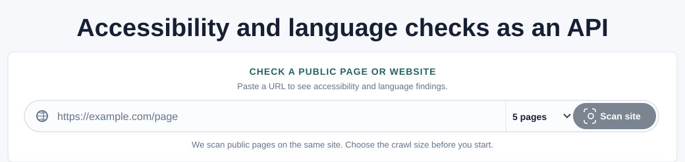

```text
  ___  ____  _____ _   _    _    ____     _
 / _ \|  _ \| ____| \ | |  / \  |  _ \   / \
| | | | |_) |  _| |  \| | / _ \ | | | | / _ \
| |_| |  __/| |___| |\  |/ ___ \| |_| |/ ___ \
 \___/|_|   |_____|_| \_/_/   \_\____//_/   \_\
        OPEN ACCESS FOR THE PUBLIC WEB
```

# OpenADA

[](https://github.com/techcto/openada/actions/workflows/ci.yml)
[](https://github.com/techcto/openada)

OpenADA is open-source accessibility infrastructure for web and document workflows. It gives developers, agencies, public entities, and site owners one stable API for axe-core WCAG audits, veraPDF PDF/UA-1 validation, and real LanguageTool spelling and grammar checks.

OpenADA is open-source infrastructure for finding concrete accessibility and
language problems, tracking remediation over time, and making those results
available through a web UI, REST API, OpenAPI, and Model Context Protocol.

## The Problem

The Department of Justice's April 20, 2026 interim final rule extended the Title II compliance date to April 26, 2027 for covered public entities with populations of 50,000 or more, and to April 26, 2028 for smaller public entities and special district governments. The extension acknowledges the practical burden; it does not make accessible public services optional. Read the [Federal Register rule](https://www.federalregister.gov/documents/2026/04/20/2026-07663/extension-of-compliance-dates-for-nondiscrimination-on-the-basis-of-disability-accessibility-of-web).

This is a serious compliance and delivery problem, not a cosmetic feature request. Inaccessible public services can lead to complaints, Department of Justice enforcement, litigation, settlement obligations, attorneys' fees, and expensive remediation. The exact remedy depends on the facts and applicable law, but the financial and operational consequences are real. OpenADA does not determine legal compliance or liability; it helps teams find and fix concrete problems before they become harder and more expensive to address.

Every public website is part of a public service: applying for a permit, finding an emergency contact, paying a bill, registering for school, or understanding a local policy. When a site is inaccessible, residents with disabilities are shut out of the same services everyone else depends on.

This is a national delivery problem, not a niche feature request. State and local governments are working through the DOJ's web-accessibility requirements while facing limited budgets, small technology teams, aging websites, vendors, PDFs, forms, and thousands of pages that must be understood and improved.

Commercial accessibility platforms can be difficult for a small city, county, school district, library, or special district to afford. OpenADA is built around a simple public-interest proposition: every government should be able to scan its own website for free, see which pages need attention, understand the findings, and measure improvement over time. The project starts as free infrastructure for public entities and developers; optional enterprise API capacity can help fund continued public access later.

OpenADA is not a legal determination or a substitute for human accessibility testing, procurement review, or counsel. It is a practical starting point that turns a large, expensive, easy-to-ignore problem into a queue of concrete pages and findings.

## Try OpenADA

Paste a public URL, choose a crawl size, and press **Scan site**. OpenADA queues the work, shows live progress while pages are checked, and redirects to a public report. A visitor can then move through the archive:

`site -> scan date -> pages -> page findings -> the same page across time`



The checker makes the first step clear: paste a public page or website URL, choose how many same-site pages to scan, and start the crawl.

Try it live:

- [OpenADA checker](https://openada.us/)
- [Public API reference](https://openada.us/api-reference)
- [ADA guidance](https://openada.us/docs)

### AI Access And Product Modes

OpenADA is usable in the tools where developers and accessibility teams already
work. The public MCP endpoint is documented for **ChatGPT Developer Mode**,
**OpenAI Codex CLI and IDE**, and **Claude custom connectors**. Each integration
has step-by-step setup instructions, the correct `/mcp` endpoint, authentication
guidance, example prompts, and links to the official client documentation in the
[MCP connection guide](https://openada.us/docs/mcp).

The project has two complementary deployment products:

- **Public OpenADA:** a hosted, anonymous service for testing public pages,
  running bounded same-host scans, browsing dated reports, and trying the API or
  MCP tools without managing infrastructure.
- **Private OpenADA:** an upcoming customer-owned ECS deployment for
  organizations that need their own UI, API, scan worker, Redis queue,
  DynamoDB archive, VPC, API keys, allowed-host controls, and operational
  boundary.
- **OpenADA MCP AgentCore:** a separate ARM64, stateless MCP gateway for Amazon
  Bedrock AgentCore Runtime. It connects an AI agent to either the hosted public
  service or a private OpenADA endpoint; AgentCore supplies the AWS IAM/SigV4
  runtime boundary while OpenADA performs the checks and scans.

## Core Capabilities

- A live URL scan creates a durable asynchronous job and never blocks the web request while a crawl runs.
- The UI reports pages scanned, queued work, current URL, and crawl errors before redirecting to the archive.
- Scan jobs retain their reports for direct progress and report views without publishing a public directory.
- The API supports `/api/v1/check`, `/api/v1/ada/check`, `/api/v1/pdf/check`, `/api/v2/check`, and `/api/v1/scans`.
- ChatGPT, Codex, and Claude can connect to the public `/mcp` endpoint using the documented client-specific setup paths.
- The same MCP tools can point at a protected Private OpenADA endpoint through `OPENADA_API_KEY` or run behind the AgentCore IAM/SigV4 boundary.
- Public OpenADA, planned Private OpenADA, and approved OpenADA MCP AgentCore
  are documented as separate deployment choices rather than one oversized
  installation.
- The deployment can be reproduced from the repository with Docker, CloudFormation, and GitHub Actions.

## What It Does

OpenADA is a complete turnkey service, not a code sample or a dashboard mockup.
The repository carries the product experience, application services, async
processing, persistence, deployment infrastructure, AI integration, release
automation, and operator documentation needed to run it end to end.

- Runs `axe-core` against submitted HTML in the API container.
- Returns LanguageTool-compatible results from `POST /api/v2/check`.
- Validates base64-encoded PDFs against PDF/UA-1 with veraPDF at `POST /api/v1/pdf/check`.
- Supports a combined `POST /api/v1/check` request for HTML editors and page workflows.
- Runs as five focused containers: UI, API, asynchronous worker, LanguageTool, and veraPDF; the sidecars share the API/worker tasks rather than becoming public services.
- Uses Redis for queue delivery and DynamoDB for public sites, pages, scan history, findings, and durable job progress.
- Includes a hosted widget that can scan a public page and display its score.
- Exposes OpenAPI and MCP interfaces so both software integrations and AI agents can use the same service.
- Runs a real LanguageTool server locally and supports a managed upstream through `LANGUAGETOOL_UPSTREAM_URL`.
- Runs a pinned veraPDF 1.30.2 sidecar locally and supports an external wrapper through `VERAPDF_UPSTREAM_URL`.
- Ships public and private operating modes, plus a separate stateless AgentCore gateway for AWS-native AI access.

## Turnkey Platform

Every major layer is included and connected:

| Layer | Included capability |
| --- | --- |
| Public experience | URL-first checker, crawl controls, live scan progress, direct reports, printing, and ADA guidance |
| Developer surface | Web accessibility, PDF/UA, LanguageTool-compatible, combined-check, OpenAPI, widget, and health endpoints |
| AI surface | Stateless MCP tools for ChatGPT, Codex, Claude, and Amazon Bedrock AgentCore |
| Scan engine | Same-host crawler, robots-aware public-page fetching, bounded async jobs, retryable progress, and page-level results |
| Persistence | Redis queue plus DynamoDB tables for sites, pages, scans, findings, and job state |
| AWS deployment | ECS Fargate with task-local LanguageTool and veraPDF sidecars, ALB routing, IAM roles, CloudWatch logs, optional ACM HTTPS, and CloudFormation |
| Delivery | Versioned ARM64 and AMD64 container builds, Marketplace changesets, S3-hosted CFTs, CI checks, and release documentation |

The result is a service that can be tried publicly in seconds, run locally with
Docker Compose, launched privately from AWS Marketplace, or placed behind an AI
agent without rebuilding the core application.

## Local Development

Clone with submodules, then run the full local stack with Docker Compose:

```bash
git clone --recurse-submodules https://github.com/techcto/openada.git
cd openada
docker compose up --build
```

Docker Compose builds the UI, API, asynchronous worker, Redis queue, DynamoDB
Local storage, the pinned LanguageTool server from
`submodules/docker-languagetool`. The local archive tables are created
automatically, so a local AWS account and `OPENADA_*_TABLE` values are not
required. It also builds the pinned veraPDF sidecar. To use separately managed
providers, set `LANGUAGETOOL_UPSTREAM_URL` and/or `VERAPDF_UPSTREAM_URL`. Stop
the stack with `docker compose down`.

For an automated local container smoke test, run `./cmd.sh compose-test`. It builds the application containers, waits for the API health check, verifies the UI, sends a combined ADA/language request, and tears the stack down afterward.

For a terminal smoke test against the hosted public service, run:

```bash
./ada.sh
./ada.sh scan https://example.com 5
```

The script requires `curl` and Node.js, checks health, runs the combined API,
discovers MCP tools, performs one MCP page check, and optionally queues a scan
and polls its progress. Set
`OPENADA_URL` for a private deployment and `OPENADA_API_KEY` when that
deployment requires authentication.

Run the hosted command-line client with one line:

```bash
curl -fsSL https://openada-us.s3.amazonaws.com/ada.sh -o ada.sh && chmod +x ada.sh && ./ada.sh
```

Open `http://localhost:3000`. The API health check is `http://localhost:3001/api/health`.
The human-readable ADA guide is available at `http://localhost:3000/docs`.
The API reference is at `http://localhost:3000/api-reference`. The homepage starts site crawls at five pages by default; the selector supports 25, 50, and 100 pages. The legacy public directory is disabled by default.

The UI proxies `/api/*` to the API container. For a direct request:

```bash
curl -X POST http://localhost:3001/api/v1/check \
  -H 'Content-Type: application/json' \
  -d '{"html":"<main></main>","text":"This langauge needs a check."}'
```

## API Contract

`POST /api/v1/ada/check`

```json
{
  "html": "<main>...</main>",
  "url": "https://example.com/page",
  "wcagTags": ["wcag2a", "wcag2aa", "wcag21aa"]
}
```

`POST /api/v1/language/check` returns a compact `{ errors, issues, raw }` payload for application integrations.

`POST /api/v1/check` accepts `html`, optional `text`, `language`, `url`, and `wcagTags`, and returns both `ada` and `language` results. When `url` is supplied without `html`, OpenADA fetches the public HTML page with bounded redirects, a 15-second timeout, and a 2 MB response limit.

`POST /api/v2/check` follows the LanguageTool `/v2/check` response shape. This makes it easy for websites, publishing tools, and developer workflows to adopt OpenADA without changing their existing language-check integration.

`POST /api/v1/pdf/check` accepts `{ "file": "<base64>", "filename": "document.pdf", "private": true }`, rejects decoded files over 10 MB, and returns a normalized PDF/UA-1 result plus the unmodified veraPDF JSON report.

`POST /api/v1/scans` accepts a public `url` and runs both web checks. Set `crawl: true` to follow same-host links from the starting page; the bounded crawl scans up to 100 pages (`maxPages`, default 50). The machine-readable OpenAPI document is available at `/api/openapi`. Public directory reads and publication are disabled by default with `OPENADA_PUBLIC_DIRECTORY_ENABLED=false`.

Every ADA result includes a letter grade derived from the numeric score: `A+` (97-100), `A` (93-96), `B` (85-92), `C` (70-84), `D` (50-69), or `F` (0-49). Set `OPENADA_PUBLIC_SCANS_ENABLED=false` to disable URL scanning, or set `OPENADA_SCAN_ALLOWED_HOSTS=example.com,another.example` to limit allowed hosts. `OPENADA_API_KEYS` protects submissions when configured.

Set `OPENADA_API_KEYS` to a comma-separated list to require `Authorization: Bearer <key>` or `X-API-Key: <key>`. Set `OPENADA_CORS_ORIGINS` to a comma-separated allowlist in production.

## OpenADA For ChatGPT, Codex, And Claude

OpenADA also speaks [Model Context Protocol (MCP)](https://modelcontextprotocol.io/). This makes the public accessibility archive available inside AI coding tools instead of trapping it in a dashboard. Connect the Streamable HTTP endpoint:

```text
https://openada.us/mcp
```

The MCP server checks a public page, queues a same-host site scan, and reads durable scan progress. A scan returns a job ID immediately, so an agent can keep the user informed while the worker checks pages. Its legacy directory tool returns disabled unless an operator explicitly enables the directory.

- **ChatGPT:** enable Developer mode, create a New Plugin or custom app, and enter `https://openada.us/mcp` as the Server URL. The [MCP connection and submission guide](https://openada.us/docs/mcp) has the full flow.
- **Codex:** add the URL from MCP settings, or put `[mcp_servers.openada]` with `url = "https://openada.us/mcp"` in `~/.codex/config.toml`, then run `codex mcp list`.
- **Claude:** add OpenADA from Settings > Connectors > Add custom connector, then enter `https://openada.us/mcp` as the Remote MCP server URL.

See the full [MCP connection guide](devops/mcp/README.md) and the public [MCP documentation](https://openada.us/docs/mcp). The anonymous public service is limited to public URLs; protected deployments can require `OPENADA_API_KEYS`. Automated results are engineering guidance, not legal advice or a compliance certification.

## Website Integration

Any website, application, publishing workflow, or build pipeline can post editor text or rendered page content to OpenADA. Point the integration at the OpenADA API base URL, for example:

```text
https://openada.example.com/api
```

Use `https://openada.example.com/api/v2/check` for LanguageTool-compatible checks, `/api/v1/ada/check` for server-side web accessibility checks, `/api/v1/pdf/check` for PDF/UA-1 validation, and `/api/v1/check` when one request should return both web checks. The same endpoints work for CMS platforms, static sites, custom applications, and CI pipelines.

## AWS Deployment

OpenADA packages the application and its AWS operating model together. The
CloudFormation templates turn the core service into a repeatable launch rather
than a hand-assembled collection of cloud resources. The standalone path creates
the surrounding environment; the existing-environment path adds OpenADA to an
ECS platform that is already operated by the customer.

`devops/cloudformation/openada.yaml` provisions:

- ECS Fargate cluster and task execution roles
- Public ALB with `/api/*` routed to the API service
- UI, API, and scan-worker services with health checks and durable job progress
- Task-local LanguageTool and veraPDF sidecars with no service-discovery dependency
- CloudWatch log groups for the application services
- Redis-backed scan queue and four on-demand DynamoDB tables for sites, pages, immutable scan records, and scan jobs
- Optional ACM HTTPS listener

### OpenADA MCP AgentCore

[OpenADA MCP AgentCore](devops/agentcore/README.md) is a separate Marketplace product for customers who want a serverless Amazon Bedrock AgentCore Runtime front end for a hosted or private OpenADA service. It uses the dedicated `openada-agentcore` ARM64 image and the [`openada-agentcore-runtime.yaml`](devops/cloudformation/openada-agentcore-runtime.yaml) template. Choose `PUBLIC` networking for an HTTPS OpenADA endpoint or `VPC` networking when AgentCore must reach an internal OpenADA ALB. AgentCore handles IAM/SigV4 at the runtime boundary; the gateway uses `OPENADA_API_KEY` only for the outbound request to the private OpenADA MCP endpoint.

Subscribe to [OpenADA MCP AgentCore on AWS Marketplace](https://aws.amazon.com/marketplace/pp/prodview-2bjfvhksfwuwq?sr=0-1&ref_=ucaf&applicationId=AWSMPContessa) when you need the managed AgentCore Runtime front end. The AgentCore product has its own Marketplace identity and release workflow; configure its private Marketplace product identifier as the `MP_AWS_AGENTCORE_PRODUCT_ID` repository variable. It must not reuse the OpenADA Private ECS product identifier. Version tags build the AgentCore image, publish its CFT to `s3://openada-us/cloudformation/`, and submit its separate delivery-option changeset.

<a href="https://console.aws.amazon.com/cloudformation/home#/stacks/create/review?templateURL=https://openada-us.s3.amazonaws.com/cloudformation/openada-agentcore-runtime.yaml&amp;stackName=openada-agentcore"></a>

Use the separate [OpenADA Private Quickstart](devops/cloudformation/README.md) for the ECS product and the separate [OpenADA MCP AgentCore Quickstart](devops/agentcore/README.md) for the AgentCore product.

## Open-Source Components

The LanguageTool container source is pinned as an official git submodule at
`submodules/docker-languagetool`. After pulling a revision that changes
submodules, run `git submodule update --init --recursive`.

See [THIRD-PARTY-NOTICES.md](THIRD-PARTY-NOTICES.md) for the open-source notices for axe-core, LanguageTool, veraPDF, and Playwright.

## License

OpenADA is released under the [MIT License](LICENSE).
